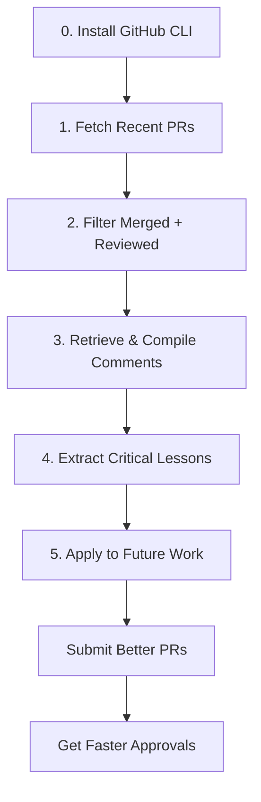

# Learning from PR Feedback: A Step-by-Step Guide

**How to extract and preserve code review insights from your GitHub pull requests using Claude Code**

---

## Table of Contents

1. [Prerequisites: GitHub Integration Setup](#0-prerequisites-github-integration-setup)
2. [Fetch Your Recent Pull Requests](#1-fetch-your-recent-pull-requests)
3. [Filter for Merged PRs with Reviews](#2-filter-for-merged-prs-with-reviews)
4. [Retrieve Review Comments and Compile Learnings](#3-retrieve-review-comments-and-compile-learnings)
5. [Capture Critical Coding Lessons](#4-capture-critical-coding-lessons)
6. [Review and Apply Learnings](#5-review-and-apply-learnings)

---

## 0. Prerequisites: GitHub Integration Setup

Before you can analyze your pull requests with Claude Code, you need to set up the GitHub CLI integration.

### Install GitHub CLI

**Windows (using winget):**
```bash
winget install --id GitHub.cli
```

**Windows (using Chocolatey):**
```bash
choco install gh
```

**macOS:**
```bash
brew install gh
```

**Linux:**
```bash
# Debian/Ubuntu
sudo apt install gh

# Fedora/RHEL
sudo dnf install gh
```

### Authenticate with GitHub

After installation, authenticate the GitHub CLI with your GitHub account:

```bash
gh auth login
```

Follow the interactive prompts:
1. Select **GitHub.com**
2. Choose **HTTPS** as your preferred protocol
3. Authenticate via **web browser** (recommended) or **paste an authentication token**
4. Complete the authentication in your browser

### Verify Installation

Test that everything is working:

```bash
gh auth status
gh pr list --limit 5
```

You should see your GitHub username and a list of recent pull requests.

### Configure Claude Code

Claude Code automatically detects the `gh` command once it's installed and authenticated. No additional configuration is needed within Claude Code itself.

---

## 1. Fetch Your Recent Pull Requests

Once GitHub CLI is set up, you can start retrieving your PR data.

### Ask Claude Code to Fetch Your PRs

In Claude Code, run:

```
can you fetch the 10 most recent prs opened by me?
```

### What Happens Behind the Scenes

Claude Code executes:
```bash
gh pr list --author=@me --limit 10
```

### Example Output

```
18860  feat(work): Bulk reset analytics         feat/bulk-reset-analytics-tracking      OPEN   2025-11-06
18701  fix(emailmanager): Fix URL regex...      fix/ott-846/zoom-links-bug              OPEN   2025-10-27
18253  chore(contentitems): Add null check...   chore/ott/solving-exception             OPEN   2025-10-01
...
```

### What You Learn

- Recent PRs you've created
- Their current status (OPEN, DRAFT, MERGED)
- Branch names and dates

**Tip:** This gives you a quick overview of your recent work and helps identify which PRs had significant review activity.

---

## 2. Filter for Merged PRs with Reviews

Most learning happens from PRs that have been reviewed and merged. Let's filter for those.

### Ask Claude to Filter

```
can you get only the ones merged and that received review comments?
```

### What Happens Behind the Scenes

Claude Code runs two operations:

1. **Fetch merged PRs:**
   ```bash
   gh pr list --author=@me --state merged --limit 50 --json number,title,url
   ```

2. **Check each PR for reviews:**
   ```bash
   for pr in [list]; do
     gh pr view $pr --json reviews --jq '.reviews | length'
   done
   ```

### Example Output

```
| PR # | Title                                                          | Reviews |
|------|----------------------------------------------------------------|---------|
| 18869 | chore(work): Renamed id property in bulk rest status api model | 5       |
| 18835 | chore(work): Optimize bulk reset n plus one queries            | 13      |
| 18642 | feat(work): Preserves rates when keep assignment is selected   | 19      |
| 18602 | chore(triage): Deprecate fnEmailTriageItemsInfoV1             | 13      |
```

### What You Learn

- Which PRs had the most reviewer engagement (higher review count = more complex/important)
- Your highest-reviewed PR (#18642 with 19 reviews) likely had the most learning opportunities
- Patterns in what gets reviewed heavily (bulk operations, performance optimizations)

**Tip:** PRs with 10+ reviews often involve architectural decisions, performance optimizations, or complex business logic worth studying.

---

## 3. Retrieve Review Comments and Compile Learnings

Now comes the valuable part: extracting the actual feedback from reviewers.

### Ask Claude to Retrieve Comments

```
can you retrieve all the comments in context so that we can learn from them?
```

### What Happens Behind the Scenes

Claude Code:

1. **Fetches detailed review data:**
   ```bash
   gh pr view 18642 --json reviews --jq '.reviews[]'
   gh pr view 18642 --json comments --jq '.comments[]'
   ```

2. **Analyzes review patterns across multiple PRs**

3. **Compiles findings into a structured document**

### The Output: REVIEW_LEARNINGS.md

Claude creates a comprehensive learning document with sections like:

```markdown
## Key Feedback Themes

### 1. Performance Optimization (N+1 Queries)
**Context**: PRs #18835, #18795
**Feedback Pattern**:
- Reviewers consistently check for N+1 query problems
- Batch database queries are the preferred solution
**Key Points**:
- Introduced `fnGetWorkItemUserProfileActorsBatch`
- Created `IntegerKeyTableType` SQL table type
**Learning**: When fetching related data in loops, always consider batch operations upfront
```

### What You Learn From This Analysis

#### Theme 1: Performance Optimization (N+1 Queries)
- **Reviewer**: mjwills-k consistently flags N+1 problems
- **Pattern**: "A few small comments" often means performance issues detected
- **Solution**: Use table-valued parameters (TVP) and batch database functions
- **Example**: `fnGetWorkItemUserProfileActorsBatch` replacing individual queries

#### Theme 2: Database Function Deprecation
- **Reviewer**: Ray highly values technical debt cleanup
- **Pattern**: Positive feedback on refactoring indicates excellent work
- **Process**: Consolidate → Update callers → Remove feature flags → Mark excluded
- **Example**: Unified `fnEmailTriageItemInfoBatchV2` replacing two legacy functions

#### Theme 3: Rate/Budget Preservation Logic
- **Reviewer**: mjwills-k focuses on edge cases
- **Pattern**: Complex PRs get 15-19 reviews vs typical 2-4
- **Standard**: >100% test coverage on new code is non-negotiable
- **Requirements**: Test ALL scenarios - single/multiple assignees, rate sources, edge cases

#### Theme 4: Endpoint Design & Backward Compatibility
- **Pattern**: New endpoints support both old and new parameters
- **Learning**: Design for migration, not breaking changes
- **Example**: `bulkUpdatePermaKey` (legacy) + `workTemplatePermaKey` (new)

#### Theme 5: Code Generation & XML Configuration
- **Pattern**: Keep `CodeGenSettings.xml` synchronized with database changes
- **Learning**: Update XML definitions when changing database objects
- **Files**: `*.CodeGenSettings.xml`, `*.ModelDefinition.xml`

### Document Structure

The generated `REVIEW_LEARNINGS.md` includes:

- **Feedback themes** with PR references
- **Reviewer patterns** (mjwills-k, ray-karbon, bobby-karbonhq)
- **Best practices summary** (Do's and Don'ts)
- **Quality metrics** (test coverage, review counts)
- **Action items** for future PRs

**Tip:** This document becomes a reference guide for your team's code review standards.

---

## 4. Capture Critical Coding Lessons

Raw feedback is valuable, but structured lessons are actionable. Let's preserve the critical insights.

### Trigger the Learning System

```
/sublation-os:learn Learn from the PR feedback. Only learn critical comments about coding.
```

### What Happens Behind the Scenes

Claude Code's learning system:

1. **Analyzes the compiled feedback** from REVIEW_LEARNINGS.md
2. **Extracts critical coding patterns** (not just general advice)
3. **Creates structured lesson entries** with:
   - Context (what happened)
   - Lesson (core principle)
   - Application (how to apply it)
   - Example (before/after code)
   - Tags (searchable keywords)
4. **Appends to categorized memory files** (`.sublation-os/memory/backend-lessons.md`)

### The Output: Three Backend Lessons

#### Entry 7: N+1 Query Performance

```markdown
### Context
Analysis of 20 merged PRs revealed that mjwills-k consistently flagged N+1 query
problems in bulk operations. PRs #18835 and #18795 required optimization through
batch database queries.

### Lesson
Always use batch database queries for bulk operations - never fetch related data
in loops. Use SQL table-valued parameters (TVP) and batch functions.

### Application
1. Identify N+1 patterns early
2. Create SQL table types: `CREATE TYPE IntegerKeyTableType AS TABLE ([Key] INT)`
3. Create batch functions: `fnGetWorkItemUserProfileActorsBatch`
4. Update CodeGenSettings.xml to generate repository methods

### Example
Wrong: foreach loop with 500 database queries
Correct: Single batch query with TVP returning all results

### Tags
`performance`, `N+1 queries`, `batch operations`, `mjwills-k`
```

#### Entry 8: Database Function Consolidation

```markdown
### Context
PR #18602 (13 reviews) showed that consolidating legacy database functions and
removing feature flags is highly valued. Ray's positive feedback on this refactoring.

### Lesson
Before removing legacy functions, create unified V2 function that handles all
scenarios, then remove feature flags. Complete removal is better than half-measures.

### Application
1. Create unified V2 function with parameters for all scenarios
2. Update CodeGenSettings.xml (mark old as excluded, add new)
3. Replace all callers with single unified call
4. Remove feature flags from FeatureStateKeyEnum.cs

### Example
Wrong: Multiple functions with nested feature flag conditionals
Correct: Single V2 function with `@isDelegatee` parameter

### Tags
`technical debt`, `database functions`, `feature flags`, `reviewer satisfaction`
```

#### Entry 9: Comprehensive Test Coverage

```markdown
### Context
PR #18642 (19 reviews - highest) showed complex budget/rate logic requires
comprehensive test coverage. All merged PRs maintained >100% coverage on new code.

### Lesson
Complex business logic with multiple execution paths requires exhaustive test
coverage of ALL scenarios before PR submission. Reviewers expect >100% coverage.

### Application
1. Identify all execution paths before coding (create test matrix)
2. Test every combination: single/multiple assignees, rate sources, edge cases
3. Test DTO migrations between versions
4. Test in unit, integration, and SQL layers

### Example
Wrong: Only happy path test (1 test)
Correct: 7+ tests covering single assignee, multiple rollup, edge cases

### Tags
`testing`, `test coverage`, `financial logic`, `edge cases`, `mjwills-k`
```

### What Gets Saved

These lessons are appended to:
```
.sublation-os/memory/backend-lessons.md
```

Future Claude sessions can:
- Search by tags (`N+1 queries`, `mjwills-k`, `test coverage`)
- Reference specific patterns when implementing similar features
- Avoid repeating mistakes that were already caught in reviews

**Tip:** These lessons become institutional knowledge that persists across sessions.

---

## 5. Review and Apply Learnings

Now that you have structured learnings, use them proactively.

### Search for Relevant Lessons

When starting new work, you can:

1. Search the lessons file by tag or keyword.

2. Use the `/sublation-os:recall` command to fetch them automatically.

3. Use any sublation-os command or agent. These files will be automatically referenced once you run `/sublation-os:update-standards-references`.

### Share With Your Team

1. **Add to onboarding docs**: New team members learn review standards
2. **Update team wiki**: Link to REVIEW_LEARNINGS.md as code review guide

---

## Summary: The Complete Workflow



### Time Investment vs. Value

| Step | Time | Value |
|------|------|-------|
| 0. GitHub CLI Setup | 5 minutes (one-time) | ∞ (enables all future analysis) |
| 1. Fetch PRs | 30 seconds | Quick overview of recent work |
| 2. Filter Reviewed | 1 minute | Identify learning opportunities |
| 3. Compile Learnings | 2-3 minutes | Comprehensive feedback analysis |
| 4. Capture Lessons | 1 minute | Structured, searchable knowledge |
| 5. Apply Learnings | Ongoing | Faster reviews, fewer revisions |

### Key Metrics From This Session

- **PRs Analyzed**: 20 merged PRs with reviews
- **Total Reviews**: 150+ review comments across all PRs
- **Patterns Identified**: 9 major feedback themes
- **Critical Lessons**: 3 backend coding lessons captured
- **Searchable Tags**: 40+ tags for future reference

### Reviewer Patterns Discovered

| Reviewer | Focus Areas | Common Phrases |
|----------|-------------|----------------|
| mjwills-k | Performance, edge cases, testing | "A few small comments", "LGTM" |
| ray-karbon | Work pillar, refactoring quality | Positive feedback on refactoring |
| bobby-karbonhq | Time pillar changes | "I'm only reviewing the X pillar" |

---

## Next Steps

### For Your Next PR

1. **Before coding**: Search lessons for similar patterns
2. **During development**: Follow identified best practices
3. **Before submission**: Run through the checklist
4. **After merge**: Update lessons if new patterns emerge

### Continuous Improvement

**Monthly Review:**
```
# Re-run this analysis monthly
gh pr list --author=@me --state merged --limit 50
# Look for new patterns in recent reviews
```

**Quarterly Cleanup:**
```
# Review and consolidate lessons
# Remove outdated patterns
# Update with new reviewer feedback
```

### Share Your Success

When this approach helps you:
- **Faster approvals**: "PR approved in 1 day instead of 3"
- **Fewer revision requests**: "No changes requested on first submission"
- **Better code**: "Proactively used batch queries - no N+1 issues"

Document these wins to encourage team adoption.

---

## Troubleshooting

### GitHub CLI Issues

**Problem**: `gh: command not found`
- **Solution**: Restart terminal after installation or add to PATH

**Problem**: `gh auth status` shows not logged in
- **Solution**: Run `gh auth login` and complete authentication

**Problem**: `gh pr list` shows no results
- **Solution**: Ensure you're in a git repository with GitHub remote

### Claude Code Issues

**Problem**: Claude can't access PR comments
- **Solution**: Check GitHub CLI has repo access: `gh auth refresh -h github.com -s repo`

**Problem**: Learning file not created
- **Solution**: Ensure `.sublation-os/memory/` directory exists

---

## Appendix: Command Reference

### GitHub CLI Commands Used

```bash
# List your PRs
gh pr list --author=@me --limit 10

# Filter by state
gh pr list --state merged --limit 50

# Get PR details
gh pr view 18642 --json reviews,comments

# Check review count
gh pr view 18642 --json reviews --jq '.reviews | length'
```

### Claude Code Slash Commands

```
/sublation-os:learn [instruction]  # Capture learning from context
/sublation-os:update-standards-references [keyword]     # Updates commands and agents references with new files
/sublation-os:recall [keyword]     # Search existing learnings
```

---

## Conclusion

By systematically analyzing PR feedback, you transform scattered review comments into structured, searchable institutional knowledge. This approach:

- **Captures** reviewer preferences and patterns
- **Preserves** critical coding lessons across sessions
- **Prevents** repeating past mistakes
- **Accelerates** PR approval times
- **Improves** code quality proactively

**The best time to learn from reviews is before you submit the next PR.**

---

*Generated from actual PR feedback analysis - 20 merged PRs, 150+ reviews, 3 critical lessons captured*

**Last Updated**: November 9, 2025
**Session**: Learning from PR Feedback with Claude Code
